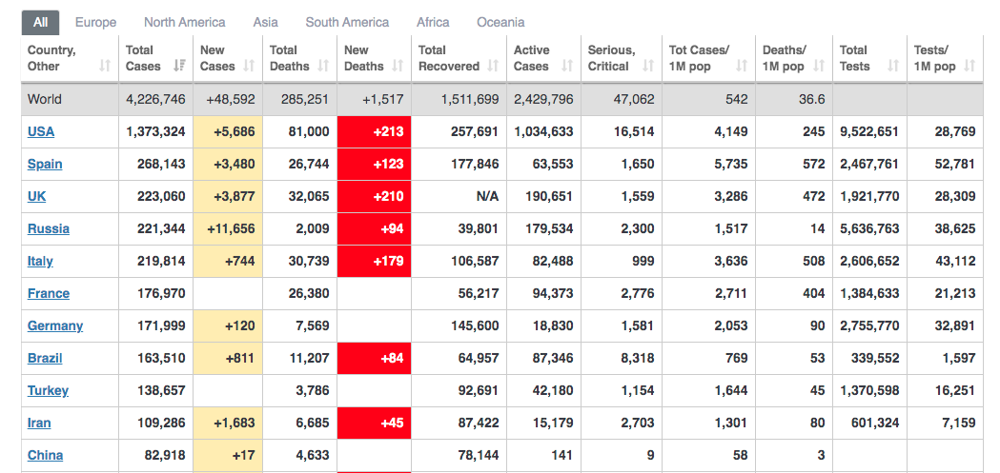
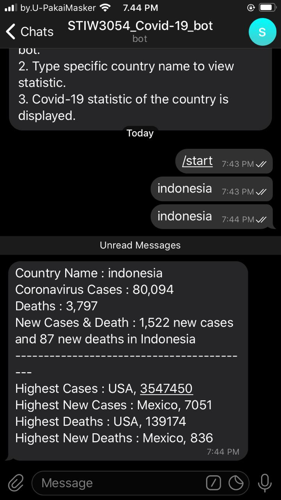
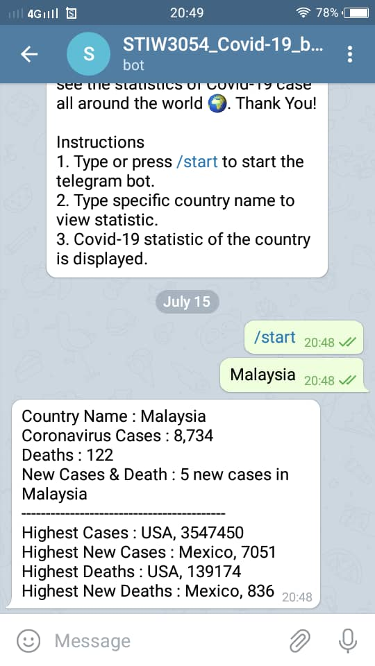
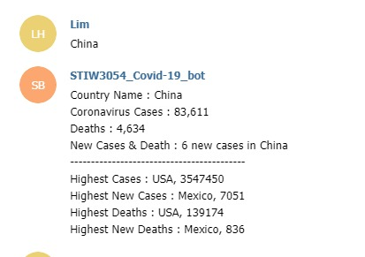
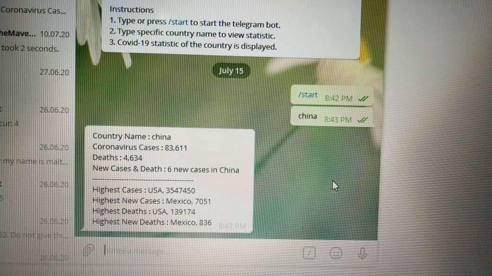
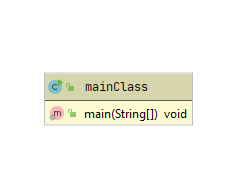
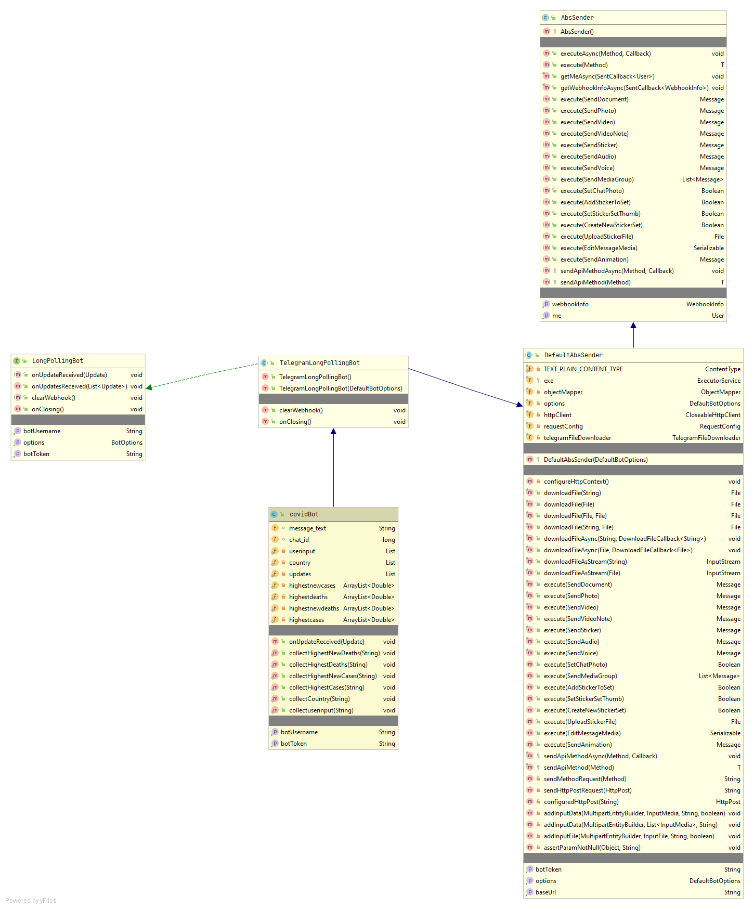

# COVID-19
A group project for Real-time Programming

## Group members :

| NO | NAME                                |MATRIC NO| ROLES  |                  PICTURE                  |
|----|-------------------------------------|---------|--------|-------------------------------------------|
| 1  | Nor Aida Binti Amuruddin            | 254660  | Leader |    |
| 2  | Ahmad Afham Bin Noor Azizan         | 250634  | Member ||          
| 3  | Shakir Zufayri Bin Osman            | 256623  | Member |  |         
| 4  | Nasuha binti Shamsull Naim          | 259265  | Member |    |      
| 5  | Siti Madihah Bt Ghozali             | 254669  | Member | |         

## Introduction
We are required to develop a real-time system using the Java programming language (Maven). The system should be able to:

## Get Covid-19 Cases
1. Read the Covid-19 Cases every __ONE (1)__ minute from the link:
   https://www.worldometers.info/coronavirus/

2. Example of the table:

3. If the website takes more than 1 minute to respond, the process will be terminated. The terminated notification will be sent to our Telegram Bots. The name of our Telegram Bots MUST use the following format:  
>STIW3054_GroupName_bot (Example: STIW3054_COVID-19_bot)

## Forward the Covid-19 info to the Telegram Bots
1. The program should be able to receive a country_name through Telegram Bots.
2. Then return the Covid-19 info back to Telegram Bots based on that country_name. 

## Testing
1. Send Telegram's link to our Whatsapp group for the testing.
2. All students in our class will test and give feedback.

## Example of input (from telegram bots):
Malaysia or any other country.

## The output (to telegram bots):
1. Total cases based on the country_name.
2. Total new cases based on the country_name.
3. Total death based on the country_name.
4. Total new death based on the country_name.
5. The country that has the highest cases.
6. The country that has the highest new cases.
7. The country that has the highest death cases.
8. The country that has the highest new death cases.

## Flow Diagram of the requirements
## User manual
1. User must access STIW3054_COVID19 BOT (https://t.me/sCovid19_bot)
2. After accessing Covid 19 bot, user must read the instruction on what the bot can do.
3. User can type /start or COVID19 to run the telegram bot.
4. The bot will display Covid19 statistic.

## Result/Output (Screenshot the telegram bots)

## UML Class Diagram
|                    MAIN CLASS UML DIAGRAM                 | 
|-----------------------------------------------------------|
||

|                 COVID BOT CLASS UML DIAGRAM               | 
|-----------------------------------------------------------|
| |

## Youtube Presentation
https://youtu.be/8ZG-egaxE20

## References

  Connect your Bot to the World - XML, JSON, Web Services, HTML Scraping, Twitter, Facebook, Telegram, Email. (2016, June). Retrieved from Botlibre: https://ru.botlibre.com/forum-post?id=13020078&__cf_chl_jschl_tk__=c4398593cac51c10a6796edddd5fc59da9cba03f-1594318537-0-ATOe3W7Z4o5kD2b3-da6Ull8-gNfDNgO04nnSgYLpO_Sh8vN2ui7oVexWvIWXVEl9q6QiYrJT2vrvHxiXUmpIhMt-cBb67KPwVZe5m0BWPKkf1O6bMbOwvOFfx336H8QJBbmbs
  
 How to Get Data From Inline Keyboard as Single Result. (2020). Retrieved from Stackoverflow.com: https://stackoverflow.com/questions/60601179/how-to-get-data-from-inline-keyboard-as-single-result

## JavaDoc
http://localhost:63342/STIW3054-Project-HelloWorld/JavaDoc/my/example/package-summary.html
